## 一、为什么机器学习中张量比标量重要？

在前 3 个阶段，DeZero 处理的变量都是标量——一个数。但真实的机器学习完全不是这样工作的：

输入一张 28×28 的图片，就是 784 个数；一批 32 张图片，就是形状 `(32, 784)` 的矩阵。标量一次算一个数，而张量可以一次完成对整批数据的所有运算，这是神经网络能高效训练的根本原因。

书中的核心发现是：**已经写好的 DeZero 函数，无需任何修改，就能直接处理张量**。原因在于这些函数!（`sin`、`add`、`mul` 等）内部用的是 NumPy 运算，而 NumPy 天然就是逐元素的。

这就是张量的价值：**把循环折叠进矩阵运算，让 NumPy 在 C 层面并行完成**，速度提升数十到数百倍。

---

## 二、逐元素计算为何天然兼容反向传播？

这是步骤 37 最精妙的洞察。书中的推导链条如下：

1. 以前的 `Sin.backward` 是按标量推导的：`gx = gy * cos(x)`
2. 对张量 `x` 调用 `sin`，NumPy 将其理解为"对每个元素分别做 sin"
3. 反向传播也随之"对每个元素分别做 `gx_i = gy_i * cos(x_i)`"
4. 结果：`x.grad` 的形状与 `x.data` 的形状完全一致 ✓
   
   关键公式 `gx = gy * cos(x)` 在标量时成立，张量时同样成立——因为 `*` 和 `cos` 都是逐元素的 NumPy 运算，形状自然保持不变。这就是书中说"以标量为前提实现的反向传播，对张量也有效"的数学原因。

---

## 三、雅可比矩阵是什么？前向模式 vs 反向模式

这是步骤 37 的进阶内容（补充节 37.3），解释了为什么深度学习框架都用反向传播而不是前向传播。

这张图揭示了一个深刻的事实：**反向传播（反向模式自动微分）之所以成为深度学习的标准，是因为只需要传播 n 维向量，而不是 n×n 的雅可比矩阵**。对于 100 万参数的网络，前者需要 100 万个数，后者需要 1 万亿个数——这在实践中完全不可行。

对于逐元素函数，情况还更简单：雅可比矩阵是对角矩阵，"向量 × 矩阵"退化成了"向量逐元素相乘"，这正是 `gx = gy * cos(x)` 的由来。

---

## 四、梯度形状必须与数据形状一致，这是为什么？

这是步骤 37 提出的最重要的约束，也是后续步骤 38-40 实现 reshape、sum、broadcast 等函数的基础原则。

从链式法则的角度来理解：

对于输入张量 `x`，损失 `L` 对它的梯度 `∂L/∂x` 的含义是——把 `x` 的每个分量 `x_ij` 微微扰动，损失会怎么变。既然 `x_ij` 和 `x` 有相同的下标组合，`∂L/∂x` 自然也和 `x` 有完全一样的形状。

```python
# 验证：无论 x 是什么形状，x.grad 形状必须和它一样
x = Variable(np.array([[1, 2, 3], [4, 5, 6]]))   # shape: (2, 3)
c = Variable(np.array([[10,20,30],[40,50,60]]))    # shape: (2, 3)
t = x + c                                          # shape: (2, 3)
y = F.sum(t)                                       # shape: () ← 标量
y.backward(retain_grad=True)

print(y.grad)    # variable(1)       ← shape: ()
print(t.grad)    # variable([[1,1,1],[1,1,1]])  ← shape: (2, 3) ✓
print(x.grad)    # variable([[1,1,1],[1,1,1]])  ← shape: (2, 3) ✓
print(c.grad)    # variable([[1,1,1],[1,1,1]])  ← shape: (2, 3) ✓
```

这条约束之所以重要，是因为它是实现非逐元素函数时的唯一设计准则：**当你不确定一个函数的反向传播该怎么写，就问自己"怎样才能让梯度的形状和输入数据的形状一致？"**，答案就是正确的实现。

| 函数                     | 正向传播形状变化 | 反向传播必须做的事              |
| ------------------------ | ---------------- | ------------------------------- |
| `reshape(x, new_shape)`  | `(2,3) → (6,)`   | 把梯度 reshape 回 `(2,3)`       |
| `sum(x)`                 | `(2,3) → ()`     | 把标量梯度 broadcast 成 `(2,3)` |
| `broadcast_to(x, shape)` | `(3,) → (2,3)`   | 把梯度沿广播的轴 sum 回 `(3,)`  |

这三行就是步骤 38、39、40 的全部核心逻辑——它们看起来复杂，但都是同一个原则的不同表现。

---

**步骤 37 的总结：** 这一步骤看起来简单（"张量直接就能用"），但书中借此建立了整个第 4 阶段的基础认知框架：逐元素函数免费获得张量支持；雅可比矩阵的分析解释了为何反向模式是唯一实用的选择；而"梯度形状=数据形状"这条约束，将成为后续所有非逐元素函数实现的指路灯。
