## 步骤 38：改变形状的函数

这一步骤要解决一个前面没有遇到过的新问题：**不做数值计算、只改变形状的函数，它的反向传播怎么写？**

---

### 一、核心原则回顾

步骤 37 确立了一条铁律：

```
x.data.shape == x.grad.shape
```

这条约束是本步骤一切推导的起点。`reshape` 和 `transpose` 都改变了张量的形状，所以反向传播必须"把形状变回来"——这不是随便猜的，而是从这条约束直接推导出来的。

---

### 二、reshape 的反向传播

**正向传播做了什么？**

```python
x = np.array([[1, 2, 3], [4, 5, 6]])   # shape: (2, 3)
y = x.reshape(6,)                        # shape: (6,)
```

reshape 不改变任何数值，只改变了"如何解读这块内存"。元素还是那 6 个，排列方式变了。

**反向传播该怎么做？**

假设从输出端传来的梯度 `gy` 形状是 `(6,)`。但我们需要 `x.grad` 形状是 `(2, 3)`。

答案直接从约束推出：**把 `gy` reshape 回输入的形状就行了**，数值一个都不用动。

**为什么不需要改数值？** 因为 reshape 建立的是元素之间的一一对应关系——位置 `[0,0]` 对应 `[0]`，`[0,1]` 对应 `[1]`，以此类推。损失对 `x[0,0]` 的梯度就等于损失对 `y[0]` 的梯度，不需要做任何换算，搬过去就行。

**代码实现：**

```python
# dezero/functions.py

class Reshape(Function):
    def __init__(self, shape):
        self.shape = shape             # 目标形状

    def forward(self, x):
        self.x_shape = x.shape        # 记住输入的形状！反向时要用
        y = x.reshape(self.shape)
        return y

    def backward(self, gy):
        return reshape(gy, self.x_shape)   # 把梯度 reshape 回输入的形状


def reshape(x, shape):
    if x.shape == shape:
        return as_variable(x)          # 形状已经一样，直接返回
    return Reshape(shape)(x)
```

注意 `forward` 里用 `self.x_shape = x.shape` 把输入形状存下来——这是 DeZero 函数类的标准模式，正向传播"存档"，反向传播"读档"。

---

### 三、transpose 的反向传播

转置比 reshape 稍微多一点思考。

**正向传播：** 把矩阵的行和列互换。

```
x: shape (2, 3)      y = x.T: shape (3, 2)
[[1, 2, 3],    →    [[1, 4],
 [4, 5, 6]]          [2, 5],
                      [3, 6]]
```

**反向传播该怎么做？** 同样用约束推导：`gy` 的形状是 `(3, 2)`，我们需要 `x.grad` 形状是 `(2, 3)`。把 `gy` 转置一次，正好变回 `(2, 3)`。

**为什么转置的逆操作还是转置？** 数学上转置是一个对合运算（involution），即 `(Aᵀ)ᵀ = A`。你把行列换了，再换回来，就是原来的样子。

**代码实现：**

```python
# dezero/functions.py

class Transpose(Function):
    def forward(self, x):
        y = np.transpose(x)     # 正向：用 NumPy 转置
        return y

    def backward(self, gy):
        gx = transpose(gy)      # 反向：再转置一次（调用自己！）
        return gx


def transpose(x):
    return Transpose()(x)
```

`backward` 调用的 `transpose` 就是刚定义的这个函数，递归引用自身——因为反向传播本身也是一次合法的 DeZero 计算，会自动建立计算图。

---

### 四、在 Variable 类上添加便捷方法

目前用法是 `F.reshape(x, (2,3))`，但 NumPy 的风格是 `x.reshape(2,3)` 或 `x.T`——让 Variable 也支持这种写法，只需在 `Variable` 类中加几行。

**实现代码（`dezero/core.py`）：**

```python
import dezero   # 延迟导入，避免循环引用

class Variable:
    ...

    # reshape 方法：支持多种传参方式
    def reshape(self, *shape):
        # 处理三种调用形式：
        # x.reshape((2, 3))  → shape = ((2,3),)，需要解包
        # x.reshape([2, 3])  → shape = ([2,3],)，需要解包
        # x.reshape(2, 3)    → shape = (2, 3)，直接用
        if len(shape) == 1 and isinstance(shape[0], (tuple, list)):
            shape = shape[0]
        return dezero.functions.reshape(self, shape)

    # transpose 方法
    def transpose(self):
        return dezero.functions.transpose(self)

    # T 属性：x.T 和 x.transpose() 等价
    @property
    def T(self):
        return dezero.functions.transpose(self)
```

注意这里用 `import dezero` 而不是 `from dezero.functions import reshape`，是为了**避免循环导入**：`core.py` 被 `functions.py` 导入，如果 `core.py` 又直接导入 `functions.py`，Python 会报循环引用错误。用 `dezero.functions.reshape` 的写法是延迟到调用时才解析，绕过了这个问题。

**效果验证：**

```python
x = Variable(np.array([[1, 2, 3], [4, 5, 6]]))

# 以下四种写法完全等价
y1 = F.reshape(x, (6,))
y2 = F.reshape(x, (2, 3))
y3 = x.reshape(6,)
y4 = x.reshape(2, 3)      # 可变参数，不用写元组

# 转置
z1 = F.transpose(x)
z2 = x.transpose()
z3 = x.T                   # 最简洁

# 反向传播完全正常
y3.backward(retain_grad=True)
print(x.grad)  # variable([[1 1 1], [1 1 1]])  ← shape (2,3) 正确 ✓
```

---

### 五、整体设计模式总结

步骤 38 建立了一个非常清晰的模式，后续所有"非逐元素函数"都遵循同样的套路：

| 环节          | reshape                     | transpose                  |
| ------------- | --------------------------- | -------------------------- |
| `forward`     | `x.reshape(new_shape)`      | `np.transpose(x)`          |
| 存档          | `self.x_shape = x.shape`    | （无需存档，转置是对合的） |
| `backward`    | `reshape(gy, self.x_shape)` | `transpose(gy)`            |
| 反向的本质    | 形状还原                    | 形状还原（用转置实现）     |
| Variable 方法 | `x.reshape(*shape)`         | `x.transpose()` / `x.T`    |

两个函数的反向传播都没有任何"真正的数学计算"，只是形状变换——这正是因为它们在正向传播中也没有做数学计算，只是重新安排了元素的排列方式。**正向传播做了什么，反向传播就撤销什么**，这是实现形状变换函数反向传播的根本直觉。
