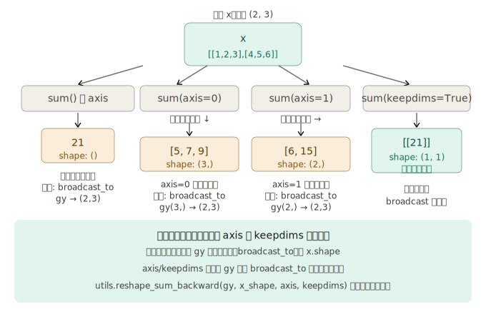

## 步骤 39：求和函数 sum

步骤 39 是步骤 37-41 这个"张量工具箱"里承上启下的一环。它本身的逻辑很清晰，但它引出的 `broadcast_to` 依赖关系，以及 `axis`/`keepdims` 参数带来的形状问题，值得仔细拆解。

---

### 一、从加法反向传播说起：sum 的梯度从哪里来

书中用一个聪明的类比推导 sum 的反向传播。先回忆**加法**的反向传播：

```
y = x₀ + x₁    →    gx₀ = gy,  gx₁ = gy
```

输出端来的梯度原样复制给两个输入。现在把这个想法推广到向量：

```
y = x[0] + x[1] + x[2] + ... + x[n-1]
```

这其实是把 n 个标量加在一起——反向传播时，同一个梯度 `gy` 要分别传回给每个 `x[i]`。传回去的方式就是**复制**。

反向传播的操作名叫 `broadcast_to(gy, x.shape)`——把标量梯度复制扩展回输入的形状。注意：`broadcast_to` 在步骤 39 里是被预先"借用"的，正式实现在步骤 40。步骤 39 和 40 是**相互依赖、一起设计**的。

---

### 二、二维矩阵的 sum：形状到底怎么变？

把 sum 从一维推广到二维，形状变化需要想清楚：


---

### 三、为什么反向传播需要 reshape_sum_backward 这个中间步骤

这是步骤 39 里书中"一笔带过"却值得展开的细节。问题出在 `axis` + `keepdims=False` 的组合上：

```python
x.shape = (2, 3)

# 情况A：sum(axis=0)
y.shape = (3,)      # gy.shape = (3,)
# 想做 broadcast_to(gy, (2,3))
# gy.shape (3,) → 可以广播成 (2,3)，没问题

# 情况B：sum(axis=1)
y.shape = (2,)      # gy.shape = (2,)
# 想做 broadcast_to(gy, (2,3))
# gy.shape (2,) → 广播成 (2,3) 时 NumPy 会把 2 对应到 axis=1 方向，结果错了！
# 正确做法是先把 gy 变成 (2,1)，再广播到 (2,3)
```

`keepdims=True` 正好解决这个歧义——输出形状是 `(2,1)` 而不是 `(2,)`，广播方向明确。当 `keepdims=False` 时，`reshape_sum_backward` 负责把 `gy` 的形状先手动补回正确的"带 1"的形状，再交给 `broadcast_to`。

```python
# reshape_sum_backward 做的事（概念上）：
# sum(axis=1, keepdims=False)：gy.shape=(2,) → reshape 为 (2,1) → broadcast_to (2,3)
# sum(axis=0, keepdims=False)：gy.shape=(3,) → reshape 为 (1,3) → broadcast_to (2,3)
```

---

### 四、完整代码实现

```python
# dezero/functions.py

from dezero import utils

class Sum(Function):
    def __init__(self, axis, keepdims):
        self.axis = axis          # 沿哪个轴求和（None 表示全部）
        self.keepdims = keepdims  # 是否保留轴数量

    def forward(self, x):
        self.x_shape = x.shape   # 记住输入形状，反向时用
        y = x.sum(axis=self.axis, keepdims=self.keepdims)
        return y

    def backward(self, gy):
        # 第一步：修正 gy 的形状（处理 axis+keepdims 带来的形状歧义）
        gy = utils.reshape_sum_backward(gy, self.x_shape, self.axis, self.keepdims)
        # 第二步：broadcast 回输入形状
        gx = broadcast_to(gy, self.x_shape)
        return gx


def sum(x, axis=None, keepdims=False):
    return Sum(axis, keepdims)(x)
```

在 `Variable` 类上加方法（和 reshape、transpose 一样的惯例）：

```python
# dezero/core.py

class Variable:
    ...
    def sum(self, axis=None, keepdims=False):
        return dezero.functions.sum(self, axis, keepdims)
```

---

### 五、完整验证

```python
import numpy as np
from dezero import Variable
import dezero.functions as F

# 基础验证：一维向量
x = Variable(np.array([1, 2, 3, 4, 5, 6]))
y = F.sum(x)
y.backward()
print(y)       # variable(21)
print(x.grad)  # variable([1 1 1 1 1 1])  ← 形状 (6,) 与 x 相同 ✓

# 二维：全局 sum
x = Variable(np.array([[1, 2, 3], [4, 5, 6]]))
y = F.sum(x)
y.backward()
print(y)       # variable(21)
print(x.grad)  # variable([[1 1 1]         ← 形状 (2,3) 与 x 相同 ✓
               #            [1 1 1]])

# 带 axis：sum(axis=0)
x = Variable(np.array([[1, 2, 3], [4, 5, 6]]))
y = F.sum(x, axis=0)
y.backward()
print(y)       # variable([5 7 9])          ← shape (3,)
print(x.grad)  # variable([[1 1 1]          ← 梯度广播回 (2,3) ✓
               #            [1 1 1]])

# keepdims 保留维度数
x = Variable(np.random.randn(2, 3, 4, 5))
y = x.sum(keepdims=True)
print(y.shape)  # (1, 1, 1, 1)             ← 维度数量保持 4 维 ✓
```

---

### 六、步骤 39 在整体中的位置

sum 函数是损失函数的基础构件。均方误差 MSE 的定义是：

```python
def mean_squared_error(x0, x1):
    diff = x0 - x1
    return F.sum(diff ** 2) / len(diff)
```

没有 sum，这行代码就写不出来；没有 sum 的正确反向传播，梯度就无法从标量损失流回每个参数。所以步骤 39 不是可选功能，而是让 DeZero 能做机器学习的**必要条件**。
