## 步骤 40：广播（broadcast）函数

这是第 4 阶段技术难度最高的一步，理解它需要先把四个问题一层一层剥开。

---

### 一、什么是 NumPy 广播？

广播是 NumPy 允许**形状不同的数组之间做运算**的机制。

```python
x0 = np.array([1, 2, 3])   # shape: (3,)
x1 = np.array([10])         # shape: (1,)

y = x0 + x1                 # → [11, 12, 13]，shape: (3,)
```

NumPy 在幕后把 `x1` 的 `10` 复制成 `[10, 10, 10]`，再做加法。这个"复制"的操作，正式名字就是 `broadcast_to`。

第二个例子正是线性层 `y = matmul(x, W) + b` 中发生的事：`b` 的形状是 `(3,)`，而 `matmul` 的输出是 `(100, 3)`，NumPy 自动把 `b` 广播成 `(100, 3)` 再加。

---

### 二、为什么广播的反向传播需要 sum？

这是步骤 40 最核心的问题。书中用了一个非常精妙的类比：

> "广播就是把同一个变量用了很多次"

回想步骤之前实现加法时的逻辑：当 `y = x + x`（同一个 `x` 用两次），反向传播时梯度会从两条路径流回 `x`，然后**相加**。广播的本质完全一样——把一个元素"复制"给多个位置用，每个复制品在反向传播时都会产生一份梯度，把所有梯度**加起来**，就是原始元素的梯度。

这个推导链条非常清晰：

- 正向：`x1=[10]` → `broadcast_to` → `[10,10,10]`，然后参与加法
- 反向：`gy=[1,1,1]` 从三个方向流回来，全部累加 → `x1.grad = [1+1+1] = [3]`

这正是 `sum_to` 做的事：把 `(3,)` 的梯度 sum 成 `(1,)` 的形状。

---

### 三、broadcast_to 和 sum_to 互为逆操作

这是整个步骤 40 的核心对称关系，非常优美：

这个对称性是步骤 40 最美的地方。两个函数互相依赖，互相作为对方的反向传播，形成完美闭环：

```
broadcast_to.backward → sum_to
sum_to.backward       → broadcast_to
```

**代码实现：**

```python
# dezero/functions.py

class BroadcastTo(Function):
    def __init__(self, shape):
        self.shape = shape

    def forward(self, x):
        self.x_shape = x.shape            # 记住输入的原始形状
        y = np.broadcast_to(x, self.shape)
        return y

    def backward(self, gy):
        gx = sum_to(gy, self.x_shape)    # 反向：sum 回原始形状
        return gx


class SumTo(Function):
    def __init__(self, shape):
        self.shape = shape

    def forward(self, x):
        self.x_shape = x.shape            # 记住输入的原始形状
        y = utils.sum_to(x, self.shape)   # NumPy 工具函数
        return y

    def backward(self, gy):
        gx = broadcast_to(gy, self.x_shape)  # 反向：broadcast 回原始形状
        return gx


def broadcast_to(x, shape):
    if x.shape == shape:
        return as_variable(x)
    return BroadcastTo(shape)(x)

def sum_to(x, shape):
    if x.shape == shape:
        return as_variable(x)
    return SumTo(shape)(x)
```

两个类几乎是镜像结构，`forward` 和 `backward` 对调就是另一个类。

---

### 四、让加法等运算自动支持广播

现在到了最关键的工程问题：DeZero 的 `Add`、`Mul` 等运算在正向传播时，NumPy 会自动广播，但**反向传播时 DeZero 不知道发生了广播**，会按错误的形状传梯度。

**问题的具体表现：**

```python
x0 = Variable(np.array([1, 2, 3]))   # shape: (3,)
x1 = Variable(np.array([10]))         # shape: (1,)
y = x0 + x1                           # 正向：NumPy 自动广播，没问题

y.backward()
# 原来的 Add.backward 直接把 gy 传给 x1
# gy.shape = (3,)，但 x1.shape = (1,)
# → x1.grad 形状错误！
```

**修复方案：在 `Add.backward` 中加入 `sum_to`：**

```python
# dezero/core.py

class Add(Function):
    def forward(self, x0, x1):
        self.x0_shape, self.x1_shape = x0.shape, x1.shape   # ← 新增：记录形状
        y = x0 + x1
        return y

    def backward(self, gy):
        gx0, gx1 = gy, gy
        # 如果正向传播发生了广播（形状不同），就要把梯度 sum 回原始形状
        if self.x0_shape != self.x1_shape:
            gx0 = dezero.functions.sum_to(gx0, self.x0_shape)
            gx1 = dezero.functions.sum_to(gx1, self.x1_shape)
        return gx0, gx1
```

修复后的完整数据流：修复后验证：


```python
x0 = Variable(np.array([1, 2, 3]))   # shape: (3,)
x1 = Variable(np.array([10]))         # shape: (1,)
y = x0 + x1
y.backward()

print(x0.grad)  # variable([1 1 1])  ← shape (3,) ✓
print(x1.grad)  # variable([3])       ← shape (1,) ✓，不是 [1,1,1]！
```

`x1.grad = [3]` 的物理含义：把 `x1` 增加 1，三个输出 `y[0]`, `y[1]`, `y[2]` 各增加 1，损失总共增加 3。这正是 sum 的意义。

---

### 五、完整的修复范围

`Add` 修复完之后，书中指出 `Mul`、`Sub`、`Div` 等所有四则运算都要做相同的修改——核心模式完全一样：

```python
class Mul(Function):
    def forward(self, x0, x1):
        self.x0_shape, self.x1_shape = x0.shape, x1.shape  # 记录形状
        return x0 * x1

    def backward(self, gy):
        x0, x1 = self.inputs
        gx0 = gy * x1
        gx1 = gy * x0
        # 如果有广播，压缩梯度回原始形状
        if self.x0_shape != self.x1_shape:
            gx0 = sum_to(gx0, self.x0_shape)
            gx1 = sum_to(gx1, self.x1_shape)
        return gx0, gx1
```

---

### 六、步骤 40 在整个第 4 阶段中的地位

步骤 40 完成后，DeZero 才真正具备了处理神经网络计算的能力。以线性层为例：

```python
y = F.matmul(x, W) + b
#             ↑ x:(100,3), W:(3,4) → 输出:(100,4)
#                          ↑ b:(4,) → 广播为(100,4)
```

如果没有步骤 40，`b.grad` 的形状会是 `(100, 4)`，和 `b` 的形状 `(4,)` 不匹配，梯度下降就无法进行。有了步骤 40，`b.grad` 自动被 `sum_to` 压缩为 `(4,)`，一切正常。

**步骤 38-40 建立的完整形状约束体系：**

| 步骤 | 函数           | 正向改变形状   | 反向还原手段          |
| ---- | -------------- | -------------- | --------------------- |
| 38   | `reshape`      | 任意重排       | `reshape` 回原形状    |
| 38   | `transpose`    | 行列互换       | 再 `transpose` 一次   |
| 39   | `sum`          | 缩减维度       | `broadcast_to` 扩回去 |
| 40   | `broadcast_to` | 扩展维度       | `sum_to` 缩回去       |
| 40   | `sum_to`       | 缩减到目标形状 | `broadcast_to` 扩回去 |

这五个函数构成了一个**自洽的形状变换系统**，其中每个函数的反向传播正好是另一个函数的正向传播。从步骤 41 开始的 `matmul`、线性层、神经网络，都是建立在这套体系之上的。
