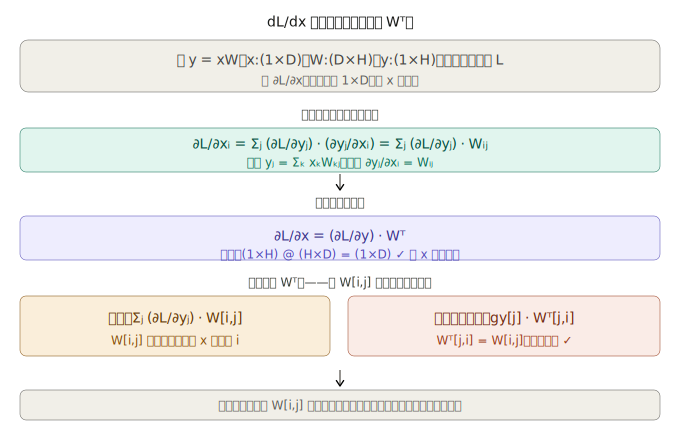

## 步骤 41：矩阵乘积（matmul）

步骤 37-40 搭好了"形状变换工具箱"，步骤 41 是第一个真正做数值计算的张量函数。它是神经网络的核心运算——没有 matmul，就没有线性层，就没有神经网络。

---

### 一、向量内积 vs 矩阵乘法：什么关系？


理解了这个关系，"形状检查"就自然而然了：

```
A(m×k) @ B(k×n) → C(m×n)
         ↑↑
     这两个 k 必须相同
```

`A` 的列数必须等于 `B` 的行数，因为每次内积需要两边维度一致。

**在神经网络中，这个规则的具体含义：**

```
x(N×D) @ W(D×H) → y(N×H)
  N 个样本          N 个样本
  每个 D 维          每个 H 维输出
```

`N=100` 个样本，每个样本 `D=784` 个像素，`W` 是 `(784×256)` 的权重矩阵，一次 matmul 就把所有样本的线性变换全算完了。

---

### 二、反向传播公式的推导

这是步骤 41 最难的部分。书中用了两种方法，我把它们合并成一个完整的推导链条。

#### 第一步：从链式法则开始（标量视角）

设 `y = x W`，其中 `x` 形状 `(1×D)`，`W` 形状 `(D×H)`，`y` 形状 `(1×H)`。

最终损失是标量 `L`，我们要求 `∂L/∂xᵢ`（L 对 x 第 i 个分量的导数）。

`xᵢ` 变化时，`y` 的**所有 H 个元素**都会跟着变，每个都影响 `L`，所以：

```
∂L/∂xᵢ = Σⱼ (∂L/∂yⱼ) · (∂yⱼ/∂xᵢ)
```

#### 第二步：计算 ∂yⱼ/∂xᵢ

展开 `yⱼ` 的定义：

```
yⱼ = x₁W₁ⱼ + x₂W₂ⱼ + ··· + xᵢWᵢⱼ + ··· + xDWDⱼ
```

对 `xᵢ` 求偏导，只有含 `xᵢ` 的那一项不为零：

```
∂yⱼ/∂xᵢ = Wᵢⱼ
```

#### 第三步：代入得到 ∂L/∂xᵢ

```
∂L/∂xᵢ = Σⱼ (∂L/∂yⱼ) · Wᵢⱼ
```

这正是向量 `∂L/∂y`（形状 `1×H`）与 `W` 第 `i` 行（形状 `1×H`）的内积。

#### 第四步：把所有分量打包成矩阵形式



#### 第五步：用同样的方法推导 dL/dW

`∂L/∂Wᵢⱼ` 的推导过程完全对称：

```
yⱼ = Σₖ xₖWₖⱼ，所以 ∂yⱼ/∂Wᵢⱼ = xᵢ

∂L/∂Wᵢⱼ = Σⱼ (∂L/∂yⱼ) · xᵢ
```

打包成矩阵形式：

```
∂L/∂W = xᵀ · (∂L/∂y)
形状：(D×1) @ (1×H) = (D×H)  ← 与 W 形状相同 ✓
```

---

### 三、形状检查法：更快验证公式的技巧

书中介绍了一个"不做推导直接验证"的方法——**形状检查法**：只要构造出来的矩阵乘法形状能对上，公式就大概率是对的（不绝对，但对于 matmul 成立）。

**形状检查法的直觉：** 要让矩阵乘法的"内层维度对齐"，唯一的方式就是把 `W` 或 `x` 转置。试试哪种转置能让形状恰好等于梯度目标形状，就是正确答案。

---

### 四、代码实现

```python
# dezero/functions.py

class MatMul(Function):
    def forward(self, x, W):
        y = x.dot(W)          # x:(N,D)  W:(D,H)  →  y:(N,H)
        return y

    def backward(self, gy):
        x, W = self.inputs    # 取出正向传播存的输入（Variable 实例）
        gx = matmul(gy, W.T)  # gy:(N,H)  Wᵀ:(H,D)  →  gx:(N,D) ✓
        gW = matmul(x.T, gy)  # xᵀ:(D,N)  gy:(N,H)  →  gW:(D,H) ✓
        return gx, gW


def matmul(x, W):
    return MatMul()(x, W)
```

三点值得注意：

**1. `self.inputs` 而不是 `self.x`：** DeZero 的 `Function` 基类在 `__call__` 时自动把所有输入存进 `self.inputs` 列表，所以不需要手动 `self.x_saved = x`。这与 reshape 里手动存 `self.x_shape` 不同，因为这里需要的是完整的 Variable（含计算图），而不只是形状。

**2. `W.T` 和 `x.T` 调用的是步骤 38 实现的 `transpose`：** 这两行代码中的转置是 DeZero 函数，不是 NumPy 函数，所以它们自己也会建立计算图节点——这是支持高阶导数（步骤 52 之后的内容）的基础。

**3. `backward` 里调用 `matmul` 就是自身：** 和 transpose 的 backward 调用 transpose 一样，这里的反向传播本身也是矩阵乘法，递归引用自己，完全合法。

**验证：**

```python
x = Variable(np.random.randn(2, 3))   # N=2, D=3
W = Variable(np.random.randn(3, 4))   # D=3, H=4
y = F.matmul(x, W)                    # y: (2, 4)
y.backward()

print(x.grad.shape)   # (2, 3)  ← 与 x 相同 ✓
print(W.grad.shape)   # (3, 4)  ← 与 W 相同 ✓
```

---

### 五、为什么 matmul 是神经网络的核心

完成步骤 41 后，DeZero 就能写出线性层了：

```python
y = F.matmul(x, W) + b
#   x(100,784) @ W(784,256) → (100,256)
#                            + b(256,) → 广播，步骤40处理
```

一行代码处理了 100 个样本、784 维输入、256 个神经元的全连接计算，且梯度自动正确。整个第 4 阶段到这里，准备工作全部完成：

| 步骤   | 解决的问题        | 对神经网络的意义                 |
| ------ | ----------------- | -------------------------------- |
| 37     | 张量支持          | 批量处理数据                     |
| 38     | reshape/transpose | 调整数据形状                     |
| 39     | sum               | 损失函数求和                     |
| 40     | broadcast         | 偏置 `b` 加到每个样本            |
| **41** | **matmul**        | **线性变换，神经网络的核心运算** |

步骤 37-41 这五步的关系用一句话总结：

> 步骤 37 确立"形状约束"原则 → 38 实现形状变换 → **39 实现缩减（sum）** → 40 实现扩展（broadcast）→ 41 实现矩阵乘法。39 和 40 是一对互逆操作，共同构成了整个形状变换体系的核心。

从步骤 42 开始，就是用这套工具箱搭真正的神经网络了。
