## 步骤 42————步骤 46 搭建神经网络

## 步骤 42：线性回归

步骤 42 是整个第 4 阶段的第一个"收获时刻"——前面 5 个步骤（37-41）搭建的所有工具，在这里第一次被组合在一起，解决一个真实的机器学习问题。

---

### 一、整体思路

线性回归要回答一个问题：**给定一堆散点，找一条最合适的直线**。

用数学语言说：找参数 `W` 和 `b`，使 `y = Wx + b` 尽量接近所有数据点。"尽量接近"用**均方误差（MSE）**来量化，用**梯度下降**来优化。


---

### 二、玩具数据集

```python
np.random.seed(0)            # 固定随机种子，保证每次运行结果一致
x = np.random.rand(100, 1)   # 100 个 x，均匀分布在 [0,1)，形状 (100,1)
y = 5 + 2 * x + np.random.rand(100, 1)  # 真实关系 y≈2x+5，加上噪声
```

数据的"真实规律"是 `y = 2x + 5`，但叠加了 `[0,1)` 的随机噪声。线性回归的任务就是从这些带噪声的散点中**恢复出** `W≈2, b≈5` 这个规律。

为什么形状是 `(100, 1)` 而不是 `(100,)`？因为后续 `matmul(x, W)` 需要 `x` 是二维矩阵（`N×D`），`D=1` 时就是 `(100,1)`。这是一个值得注意的细节，形状不对 matmul 会报错。

---

### 三、完整训练代码逐行解析**完整代码：**



```python
import numpy as np
from dezero import Variable
import dezero.functions as F

# ── 数据 ──────────────────────────────────────
np.random.seed(0)
x = np.random.rand(100, 1)                  # shape: (100, 1)
y = 5 + 2 * x + np.random.rand(100, 1)     # shape: (100, 1)，真实规律 y≈2x+5

# ── 参数（从全零开始） ─────────────────────────
W = Variable(np.zeros((1, 1)))              # shape: (1, 1)
b = Variable(np.zeros(1))                   # shape: (1,)

# ── 模型 ──────────────────────────────────────
def predict(x):
    return F.matmul(x, W) + b              # 广播：b(1,) → (100,1)

# ── 损失函数 ───────────────────────────────────
def mean_squared_error(x0, x1):
    diff = x0 - x1                          # (100,1)
    return F.sum(diff ** 2) / len(diff)     # 标量

# ── 训练循环 ───────────────────────────────────
lr = 0.1
for i in range(100):
    y_pred = predict(x)                     # 正向传播
    loss = mean_squared_error(y, y_pred)    # 计算损失

    W.cleargrad()                           # 清零（必须在 backward 前）
    b.cleargrad()
    loss.backward()                         # 反向传播，自动求梯度

    W.data -= lr * W.grad.data             # 梯度下降
    b.data -= lr * b.grad.data

print(W)     # variable([[2.118...]])   ← 接近真实值 2
print(b)     # variable([5.466...])    ← 接近真实值 5
```

---

### 四、形状追踪：每一步的张量形状

理解 matmul 和广播在这里如何协作，最清晰的方式是追踪每个张量的形状：

```
x:      (100, 1)
W:      (1,   1)
b:      (1,)

matmul(x, W):  (100,1) @ (1,1)  →  (100, 1)
         + b:  (100,1) + (1,)   →  广播，b复制为(100,1)
                               →  y_pred: (100, 1)

diff = y_pred - y:  (100,1) - (100,1)  →  (100, 1)
diff**2:            (100, 1)
sum(diff**2):       ()     ← 标量
/ 100:              ()     ← loss，标量

反向传播方向：
∂L/∂W：(1,1)  ← 与 W 形状一致 ✓
∂L/∂b：(1,)   ← 与 b 形状一致 ✓（广播的反向传播 sum_to 处理）
```

---

### 五、均方误差的两种实现方式与内存效率

步骤 42 的补充内容专门讨论了 MSE 的实现方式，这是理解 DeZero 工程设计的重要一课。**两种实现的代码对比：**

```python
# ── 朴素版（简单但内存低效）────────────────────
def mean_squared_error_simple(x0, x1):
    diff = x0 - x1              # ← Variable，进入计算图，常驻内存
    return F.sum(diff ** 2) / len(diff)

# ── 继承 Function 类版（内存高效）────────────────
class MeanSquaredError(Function):
    def forward(self, x0, x1):         # x0, x1 是 ndarray
        diff = x0 - x1                 # ← ndarray，不进计算图
        y = (diff ** 2).sum() / len(diff)
        return y                       # forward 结束，diff 立即被回收

    def backward(self, gy):
        x0, x1 = self.inputs           # 取出正向传播时保存的输入 Variable
        diff = x0 - x1                 # ← 这里重新算，但这次是 Variable 运算
        gx0 = gy * diff * (2. / len(diff))
        gx1 = -gx0
        return gx0, gx1

def mean_squared_error(x0, x1):
    return MeanSquaredError()(x0, x1)
```

`MeanSquaredError.backward` 中为什么可以重新算 `diff`？因为这里的 `x0`, `x1` 是从 `self.inputs` 取出的 Variable，`x0 - x1` 在反向传播时建立新的计算图（用于支持高阶导数），这是故意的，不是重复计算的浪费。

---

### 六、训练结果的意义

书中最终结果：

```
W = [[2.118...]]    # 真实值：2
b = [5.466...]      # 真实值：5
```

没有精确还原为 2 和 5，原因是数据本身带有噪声（`np.random.rand(100,1)` 均值是 0.5，所以 `b` 偏高约 0.5）。这是统计学习的正常现象——模型学的是带噪声数据的规律，而不是"真实函数"本身。

---

### 七、步骤 42 在整个框架中的地位

步骤 42 是 DeZero 第一次被用于解决机器学习问题。它把步骤 37-41 的所有积木拼在了一起：

| 用到的机制          | 来自步骤    | 在本步骤的作用      |
| ------------------- | ----------- | ------------------- |
| Variable / backward | 第 1-3 阶段 | 自动求梯度的基础    |
| 张量支持            | 步骤 37     | 一次处理 100 个样本 |
| matmul              | 步骤 41     | 线性变换 y=xW       |
| broadcast           | 步骤 40     | 偏置 b 加到每行     |
| sum                 | 步骤 39     | MSE 中的求和        |

从步骤 43 开始，这套"手动管理参数"的写法会被 `Parameter`、`Layer`、`Model`、`Optimizer` 等抽象层逐步替代——但底层原理和步骤 42 完全一致，理解了这一步，后面的一切都只是在做更好的封装。
