## 步骤 43：神经网络

步骤 43 是整个第 4 阶段的**核心突破**——从步骤 42 的线性回归，迈出关键的一步：加入激活函数，让模型第一次具备拟合非线性数据的能力。

---

### 一、为什么线性回归无法拟合 sin 曲线？

这是步骤 43 要回答的第一个问题，也是理解"为什么需要激活函数"的根基。

这个数学事实揭示了一件重要的事：**深度网络的"深"不是靠叠加线性层实现的，而是靠在线性层之间插入非线性的激活函数**。激活函数打断了这种"折叠成一层"的等价性。

---

### 二、sigmoid 激活函数：原理与实现

sigmoid 是步骤 43 选用的激活函数，公式为：

```
σ(x) = 1 / (1 + exp(−x))
```

它有三个关键性质使它适合作为激活函数：

**DeZero 的两种实现方式：**

```python
# ── 朴素版（sigmoid_simple）────────────────────────────
def sigmoid_simple(x):
    x = as_variable(x)
    y = 1 / (1 + exp(-x))   # 用 DeZero 的 exp，自动建计算图
    return y
# 问题：产生多个中间 Variable 节点，内存浪费

# ── 继承 Function 的高效版（dezero/functions.py 中的正式实现）──
class Sigmoid(Function):
    def forward(self, x):
        # xp 是 NumPy 或 CuPy（步骤52后支持GPU）
        xp = cuda.get_array_module(x)
        y = xp.tanh(x * 0.5) * 0.5 + 0.5   # 数值更稳定的等价写法
        return y

    def backward(self, gy):
        y = self.outputs[0]()              # 取出正向传播的输出 y
        gx = gy * y * (1 - y)             # σ'(x) = σ(x)·(1-σ(x))，直接用 y
        return gx

def sigmoid(x):
    return Sigmoid()(x)
```

性质 ③ 的价值体现在 `backward` 里：`gx = gy * y * (1 - y)` 直接用已经算好的 `y`，不需要重新计算 `exp(-x)`，这在大批量数据时节省了相当多的时间。

---

### 三、linear 函数：从步骤 42 的两行代码到一行

步骤 42 的预测函数是：

```python
y = F.matmul(x, W) + b
```

步骤 43 把这两步合并成 `F.linear(x, W, b)`，同时有两种实现，书中详细讨论了为什么要有两种：

```python
# ── 简单版（linear_simple）────────────────────────────────
def linear_simple(x, W, b=None):
    t = matmul(x, W)     # t 是中间 Variable，进入计算图，常驻内存
    if b is None:
        return t
    y = t + b
    t.data = None        # ← 关键：立即删除 t 的数据！
    return y
```

`t.data = None` 这一行是书中专门讨论的内存优化技巧。原因：

- `t` 这个 Variable 节点需要留在计算图里（反向传播要经过它）
- 但 `t.data`（具体的 ndarray 数值）在反向传播中**完全用不到**（`matmul` 的反向传播只需要输入 `x` 和 `W`，`+` 的反向传播也不需要 `t`）
- 所以可以立刻删除数值，只保留图的结构

```python
# ── 高效版（Function 类）─────────────────────────────────
class Linear(Function):
    def forward(self, x, W, b):
        y = x.dot(W)
        if b is not None:
            y += b       # 全程 ndarray，不建计算图，没有中间 Variable
        return y

    def backward(self, gy):
        x, W, b = self.inputs
        gb = None if b.data is None else sum_to(gy, b.shape)
        gx = matmul(gy, W.T)
        gW = matmul(x.T, gy)
        return gx, gW, gb
```

两种实现的计算图对比：

```
linear_simple 的计算图：
  x ──┐
      matmul ── t ── add ── y
  W ──┘         ↑
                b ──┘

Linear 类的计算图：
  x ──┐
      linear ── y
  W ──┤
  b ──┘
```

中间变量 `t` 消失了，内存占用更小。这与步骤 42 里 `MeanSquaredError` 的两种实现是完全一样的设计原则。

---

### 四、2 层神经网络的数据流

现在把所有东西组合在一起，追踪每一个张量在前向传播中的形状变化：

隐藏层维度 H=10 是一个超参数，它的含义是：每个输入样本经过第 1 层变换后，被表示为一个 10 维向量。这 10 个维度就是网络自己学习出来的"特征"，sigmoid 把它们压到 (0,1)，第 2 层再把这 10 个特征组合成最终的预测值。

---

### 五、权重初始化的讲究

步骤 43 的代码里有一个细节值得注意：

```python
W1 = Variable(0.01 * np.random.randn(I, H))   # 小随机数
W2 = Variable(0.01 * np.random.randn(H, O))
b1 = Variable(np.zeros(H))                     # 偏置初始化为0
b2 = Variable(np.zeros(O))
```

**为什么权重不能初始化为全 0？**

如果 `W1 = np.zeros((1,10))`，那么第 1 层所有 10 个神经元的输出完全相同，梯度也完全相同，训练时它们会以完全相同的方式更新，永远无法分化成不同的特征——这叫"对称性问题"。随机初始化打破了这种对称性。

**为什么要乘以 0.01（小随机数）？**

如果初始值太大，sigmoid 的输入会落在很大的正数或负数区域，而 sigmoid 在这些区域的导数接近 0（饱和区），梯度会消失，训练极慢。小初始值让激活值落在 sigmoid 的中间段（导数最大的区域）。

步骤 44 的 `Linear` 类改用了更精细的 Xavier 初始化 `np.sqrt(1/in_size)`，这是专门针对 sigmoid 设计的方案，在大网络中表现更好。

---

### 六、完整训练代码逐行解析

```python
# ── 数据集 ──────────────────────────────────────────────────
np.random.seed(0)
x = np.random.rand(100, 1)                        # x ∈ [0, 1)，形状 (100,1)
y = np.sin(2 * np.pi * x) + np.random.rand(100, 1)  # sin 波形 + 噪声

# ── 参数 ──────────────────────────────────────────────────────
I, H, O = 1, 10, 1       # 输入维度, 隐藏层维度, 输出维度
W1 = Variable(0.01 * np.random.randn(I, H))  # (1, 10)
b1 = Variable(np.zeros(H))                    # (10,)
W2 = Variable(0.01 * np.random.randn(H, O))  # (10, 1)
b2 = Variable(np.zeros(O))                    # (1,)

# ── 前向传播：定义网络结构 ─────────────────────────────────────
def predict(x):
    y = F.linear(x, W1, b1)   # 线性变换：(100,1)→(100,10)
    y = F.sigmoid(y)           # 非线性激活：(100,10)→(100,10)
    y = F.linear(y, W2, b2)   # 线性变换：(100,10)→(100,1)
    return y

# ── 训练循环 ──────────────────────────────────────────────────
lr = 0.2
for i in range(10000):
    y_pred = predict(x)                        # 正向传播，建立计算图
    loss = F.mean_squared_error(y, y_pred)     # 计算 MSE 损失

    # 清零梯度（4个参数全部手动清零，步骤44会解决这个痛点）
    W1.cleargrad(); b1.cleargrad()
    W2.cleargrad(); b2.cleargrad()

    loss.backward()    # 反向传播，自动计算所有梯度

    # 更新参数（在 .data 上操作，绕过计算图）
    W1.data -= lr * W1.grad.data
    b1.data -= lr * b1.grad.data
    W2.data -= lr * W2.grad.data
    b2.data -= lr * b2.grad.data

    if i % 1000 == 0:
        print(loss)    # 每1000步打印一次损失
```

训练 10000 步的损失下降过程大致如下：

```
step    0: loss ≈ 0.8    ← 随机初始，完全没学到
step 1000: loss ≈ 0.12
step 3000: loss ≈ 0.09
step 7000: loss ≈ 0.08
step 9000: loss ≈ 0.08   ← 收敛，sin 曲线基本拟合
```

---

### 七、为什么 H=10 能拟合 sin 曲线？（直觉）

10 个 sigmoid 神经元可以分别学习 sin 曲线的不同"局部特征"——有的学到"左边上升段"，有的学到"右边下降段"，有的学到"中间峰值"，第 2 层的权重 W2 把这些局部特征加权组合成完整的 sin 形状。这就是神经网络作为"万能函数逼近器"的直觉：足够多的 sigmoid 叠加，可以逼近任意连续函数（万能逼近定理，Universal Approximation Theorem）。

---

### 八、步骤 43 留下的问题

书中最后明确指出了步骤 43 的遗留痛点，这正是步骤 44-46 的出发点：

```python
# 4个参数，要写4行清零
W1.cleargrad(); b1.cleargrad()
W2.cleargrad(); b2.cleargrad()

# 4个参数，要写4行更新
W1.data -= lr * W1.grad.data
b1.data -= lr * b1.grad.data
W2.data -= lr * W2.grad.data
b2.data -= lr * b2.grad.data
```

如果是 10 层网络，就要写 20 行清零和 20 行更新。这不是工程上可接受的写法。步骤 44 用 `Parameter + Layer` 解决参数收集问题，步骤 45 用 `Model` 解决嵌套管理问题，步骤 46 用 `Optimizer` 封装更新逻辑——三步完成从"能用"到"好用"的跨越。
