## 步骤 44：汇总参数的层

步骤 44 要解决一个工程问题：**参数越多，管理代码越冗长**。它的解法是引入两个类——`Parameter`（标记）和 `Layer`（容器）——让参数管理从手动变成自动。

---

### 一、问题：步骤 43 的手动管理之痛

```python
# 2层网络，4个参数，每次训练循环都要写这8行
W1.cleargrad(); b1.cleargrad()   # 清零：4行
W2.cleargrad(); b2.cleargrad()

W1.data -= lr * W1.grad.data     # 更新：4行
b1.data -= lr * b1.grad.data
W2.data -= lr * W2.grad.data
b2.data -= lr * b2.grad.data
```

10 层网络就要写 40 行。而且这些代码完全没有信息量——只是在机械地重复同一个模式。

根本原因：参数是散落的全局变量，**没有人统一管理它们**。步骤 44 的解法分两步：先给参数贴标签（`Parameter`），再造一个能自动收集标签的容器（`Layer`）。

---

### 二、Parameter 类：一个空壳，但意义重大



```python
# dezero/core.py
class Parameter(Variable):
    pass
```

只有这一行有效代码。它的价值完全来自于 Python 的类型系统——`isinstance(obj, Parameter)` 返回 `True` 或 `False`，这一个布尔值就能把"需要训练的参数"和"计算中间产生的变量"区分开来。

计算结果 `y = x * p` 是 `Variable` 而不是 `Parameter`，这是正确的：中间变量不是参数，不应该被收集和更新。

---

### 三、Layer 类：自动收集参数的容器

Layer 是步骤 44 的核心，它的精妙之处在于**利用 Python 的魔法方法，把"登记参数"这件事完全自动化**。

#### 3.1 核心机制：`__setattr__` 拦截属性赋值

Python 规定：给对象赋值任何属性时（`self.xxx = yyy`），都会调用 `__setattr__`。Layer 重写了这个方法：

**为什么存名字（字符串），而不是直接存 Parameter 对象本身？**

有两个原因：第一，步骤 53 保存模型到文件时，需要用名字作为键把参数存进字典，名字是天然的键；第二，`_params` 存名字是轻量的，实际参数数据通过 `self.__dict__[name]` 按需取出，不会产生额外的引用计数问题。

**为什么必须调用 `super().__setattr__`？**

如果不调用，属性就无法真正挂到对象上，`self.W` 会报 `AttributeError`。`super().__setattr__` 是完成属性赋值的那一步，不能省略。

#### 3.2 完整 Layer 类代码

```python
# dezero/layers.py
import weakref
from dezero.core import Parameter

class Layer:
    def __init__(self):
        self._params = set()

    def __setattr__(self, name, value):
        if isinstance(value, Parameter):
            self._params.add(name)          # 自动登记
        super().__setattr__(name, value)    # 照常赋值

    def __call__(self, *inputs):
        outputs = self.forward(*inputs)
        if not isinstance(outputs, tuple):
            outputs = (outputs,)
        # 用弱引用保存输入输出，避免内存泄漏
        self.inputs  = [weakref.ref(x) for x in inputs]
        self.outputs = [weakref.ref(y) for y in outputs]
        return outputs if len(outputs) > 1 else outputs[0]

    def forward(self, inputs):
        raise NotImplementedError()    # 子类必须实现

    def params(self):
        for name in self._params:
            yield self.__dict__[name]  # 生成器：逐个取出 Parameter

    def cleargrads(self):
        for param in self.params():
            param.cleargrad()          # 一次性清零所有参数的梯度
```

`params()` 用了 `yield` 而不是 `return`，使它成为**生成器函数**。生成器是惰性的——不提前把所有参数装进列表，而是每次 `for` 循环迭代时才取下一个。参数量很大时更省内存，而且接口和普通迭代完全一样。

`__call__` 里用 `weakref.ref`（弱引用）保存输入输出变量。弱引用不会阻止垃圾回收：当外部不再需要某个变量时，即使 Layer 还持有它的弱引用，它也能被正常回收。这防止了训练循环中大量中间变量堆积在内存里。

---

### 四、Linear 层：Layer 的第一个实现

#### 简单版（帮助理解结构）

```python
class Linear(Layer):
    def __init__(self, in_size, out_size, nobias=False, dtype=np.float32):
        super().__init__()
        I, O = in_size, out_size
        W_data = np.random.randn(I, O).astype(dtype) * np.sqrt(1 / I)
        self.W = Parameter(W_data, name='W')  # ← 触发 __setattr__，'W' 进 _params
        if nobias:
            self.b = None
        else:
            self.b = Parameter(np.zeros(O, dtype=dtype), name='b')  # ← 'b' 进 _params

    def forward(self, x):
        y = F.linear(x, self.W, self.b)
        return y
```

权重用 `np.sqrt(1/I)` 而不是步骤 43 的 `0.01`——这是 **Xavier 初始化**，让每层输出的方差约等于输入的方差，防止梯度在深层网络中消失或爆炸。


#### 改进版（正式实现：延迟初始化）```python

# dezero/layers.py（改进版 Linear）

class Linear(Layer):
def **init**(self, out_size, nobias=False, dtype=np.float32, in_size=None):
super().**init**()
self.in_size = in_size # None 表示等待推断
self.out_size = out_size
self.dtype = dtype

        self.W = Parameter(None, name='W')   # data=None，但 'W' 已进 _params
        if self.in_size is not None:
            self._init_W()                   # 若指定了 in_size，立刻初始化

        if nobias:
            self.b = None
        else:
            self.b = Parameter(np.zeros(out_size, dtype=dtype), name='b')

    def _init_W(self):
        I, O = self.in_size, self.out_size
        W_data = np.random.randn(I, O).astype(self.dtype) * np.sqrt(1 / I)
        self.W.data = W_data    # 修改已有 Parameter 的 data，不触发 __setattr__

    def forward(self, x):
        if self.W.data is None:       # 第一次前向才初始化
            self.in_size = x.shape[1]
            self._init_W()
        y = F.linear(x, self.W, self.b)
        return y

````

`_init_W` 里的 `self.W.data = W_data` 是修改已有 Parameter 对象的 `.data` 属性，不是给 `self` 赋新属性，所以**不触发 `__setattr__`**，`'W'` 不会被重复加入 `_params`。这个细节说明了为什么要设计成"先占位，再填数据"的两步过程。

---

### 五、使用效果：训练代码的简化

```python
import dezero.layers as L

# 只写输出维度，输入维度自动推断
l1 = L.Linear(10)
l2 = L.Linear(1)

def predict(x):
    y = l1(x)           # 第一次调用时自动创建 W(1,10)
    y = F.sigmoid(y)
    y = l2(y)           # 第一次调用时自动创建 W(10,1)
    return y

for i in range(10000):
    y_pred = predict(x)
    loss = F.mean_squared_error(y, y_pred)

    l1.cleargrads()    # 一行清零 W 和 b 两个参数
    l2.cleargrads()
    loss.backward()

    for l in [l1, l2]:
        for p in l.params():          # 自动遍历该层所有 Parameter
            p.data -= lr * p.grad.data
````

对比步骤 43 的 8 行手动操作，现在清零变成了 2 行，更新变成了一个通用循环——无论层内有几个参数，代码都不需要改动。

---

### 六、步骤 44 留下的遗留问题

`[l1, l2]` 这个列表还是手动维护的。10 层网络就要写 `[l1,l2,...,l10]`，仍然繁琐。步骤 45 用 `Model` 类解决这个问题——让 Layer 能嵌套 Layer，从顶层的 `model.params()` 就能递归取出所有层的所有参数，`[l1, l2]` 彻底消失。

用一张表总结步骤 44 完成的工作和尚未解决的问题：

| 事项         | 步骤 43        | 步骤 44 之后            | 步骤 45 之后           |
| ------------ | -------------- | ----------------------- | ---------------------- |
| 清零单层参数 | 逐个手写       | `l.cleargrads()` ✓      | —                      |
| 更新单层参数 | 逐个手写       | `for p in l.params()` ✓ | —                      |
| 管理多个层   | 逐个手写       | 手动列表 `[l1,l2]`      | `model.cleargrads()` ✓ |
| 定义网络结构 | 散落的全局变量 | Layer 对象              | 继承 Model 的类 ✓      |
