## 步骤 45：汇总层的层（Model + MLP）

步骤 44 解决了"单个 Layer 内部参数的自动管理"，但多个 Layer 之间仍然需要手动维护列表 `[l1, l2]`。步骤 45 做了一件事：**让 Layer 能嵌套 Layer**，从顶层一次性管理所有层的所有参数。

---

### 一、步骤 44 遗留的问题

```python
# 步骤44的训练循环
l1.cleargrads()    # 还是要逐个写
l2.cleargrads()

for l in [l1, l2]:          # 手动维护层的列表
    for p in l.params():
        p.data -= lr * p.grad.data
```

10 层网络就要写 10 个 `cleargrads()`，`[l1, l2]` 变成 `[l1, ..., l10]`。根本原因是：**Layer 只认识自己的 Parameter，不认识别人家的 Layer**。步骤 45 改变这一点。

---

### 二、扩展 Layer：让它也能持有 Layer

步骤 44 的 `__setattr__` 只拦截 `Parameter`，步骤 45 在此基础上**再加一个条件**：也拦截 `Layer` 实例。

**完整的扩展代码：**

```python
# dezero/layers.py

class Layer:
    def __init__(self):
        self._params = set()

    def __setattr__(self, name, value):
        # 步骤45的关键修改：(Parameter, Layer) 元组，两者都收
        if isinstance(value, (Parameter, Layer)):
            self._params.add(name)
        super().__setattr__(name, value)

    def params(self):
        for name in self._params:
            obj = self.__dict__[name]
            if isinstance(obj, Layer):
                yield from obj.params()   # 递归进入子 Layer
            else:
                yield obj                 # 是 Parameter，直接 yield

    def cleargrads(self):
        for param in self.params():       # 自动递归到所有叶子
            param.cleargrad()
    # ... __call__, forward 等不变
```

`yield from obj.params()` 是关键一行。`yield from` 是 Python 3.3 引入的生成器委托语法，它把子生成器 `obj.params()` 的所有产出值逐一转发到当前生成器，效果等价于：

```python
for p in obj.params():
    yield p
```

但更简洁，而且也支持 `send()` 等高级生成器操作。

---

### 三、递归取参数的完整示意


`model.params()` 调用时的执行链条：

```
model.params()
  → name='l1', obj=l1（是 Layer）→ yield from l1.params()
      → name='W', obj=l1.W（是 Parameter）→ yield l1.W
      → name='b', obj=l1.b（是 Parameter）→ yield l1.b
  → name='l2', obj=l2（是 Layer）→ yield from l2.params()
      → name='W', obj=l2.W（是 Parameter）→ yield l2.W
      → name='b', obj=l2.b（是 Parameter）→ yield l2.b
```

最终 `model.params()` 产出 4 个叶子 Parameter，而用户感知不到任何嵌套结构。

---

### 四、Model 类：语义升级 + plot 方法

```python
# dezero/models.py
from dezero import Layer
from dezero import utils

class Model(Layer):
    def plot(self, *inputs, to_file='model.png'):
        y = self.forward(*inputs)
        return utils.plot_dot_graph(y, verbose=True, to_file=to_file)
```

`Model` 继承 `Layer`，只加了一个 `plot` 方法——用于把计算图可视化导出为图片。功能上和 `Layer` 完全一样，但**语义上**区分了"构建模块"（`Layer`）和"顶层模型"（`Model`）。

这和 PyTorch 的 `nn.Module` 是同一思路：所有东西在技术上都是 `Module`，但概念上"层"和"模型"有所不同。

---

### 五、以类定义模型：PyTorch 范式的起源

```python
from dezero import Model
import dezero.layers as L
import dezero.functions as F

class TwoLayerNet(Model):
    def __init__(self, hidden_size, out_size):
        super().__init__()
        self.l1 = L.Linear(hidden_size)   # ← 触发 __setattr__，'l1' 进 _params
        self.l2 = L.Linear(out_size)      # ← 触发 __setattr__，'l2' 进 _params

    def forward(self, x):
        y = F.sigmoid(self.l1(x))
        y = self.l2(y)
        return y
```

`__init__` 里写层的定义，`forward` 里写计算逻辑——这正是 Chainer 首创、PyTorch 发扬光大的"以类定义神经网络"的范式。书中明确指出了这一点。

**训练循环的精简效果：**

```python
model = TwoLayerNet(10, 1)

for i in range(10000):
    y_pred = model(x)                    # model.__call__ → model.forward
    loss = F.mean_squared_error(y, y_pred)

    model.cleargrads()                   # 递归清零所有参数，一行搞定
    loss.backward()

    for p in model.params():             # 递归取出所有参数，统一更新
        p.data -= lr * p.grad.data
```

对比步骤 43 的 8 行手写代码，现在清零是 1 行，更新是 1 个通用循环，**层数不影响训练代码的长度**。

---

### 六、MLP 类：通用多层感知器

`TwoLayerNet` 解决了具体问题，但还不够通用——要换成 3 层就得新定义一个类。`MLP` 把层数和每层大小参数化：

```python
# dezero/models.py
class MLP(Model):
    def __init__(self, fc_output_sizes, activation=F.sigmoid):
        super().__init__()
        self.activation = activation
        self.layers = []

        for i, out_size in enumerate(fc_output_sizes):
            layer = L.Linear(out_size)
            setattr(self, 'l' + str(i), layer)   # self.l0, self.l1, ...
            self.layers.append(layer)

    def forward(self, x):
        for l in self.layers[:-1]:               # 非最后层：接激活函数
            x = self.activation(l(x))
        return self.layers[-1](x)                # 最后层：不接激活函数
```

**`setattr(self, 'l0', layer)` 和 `self.l0 = layer` 完全等价**，只是前者可以用动态字符串作属性名，在循环中无法事先知道属性名时必须用这种方式。两者都会触发 `__setattr__`，`'l0'` 会自动进入 `_params`。

`forward` 的逻辑体现了全连接网络的标准模式：除最后一层外，每层线性变换后都接激活函数；最后一层不接，输出"原始分数"（logits），由损失函数决定如何处理（分类用 softmax+交叉熵，回归用 MSE）。

**使用极简：**

```python
model = MLP((10, 1))                            # 2层：隐藏10，输出1
model = MLP((10, 20, 30, 1))                    # 4层，自定义大小
model = MLP((10, 1), activation=F.relu)         # 换激活函数
model = MLP((1000, 1000, 10), activation=F.relu) # MNIST用的深层网络
```

---

### 七、步骤 45 完成后的完整训练代码

```python
from dezero import Model
from dezero.models import MLP
import dezero.functions as F

# 一行定义模型
model = MLP((10, 1))

# 训练循环：层数任意增加，这段代码不需要改动
lr = 0.2
for i in range(10000):
    y_pred = model(x)
    loss = F.mean_squared_error(y, y_pred)

    model.cleargrads()          # 一行：递归清零所有参数
    loss.backward()

    for p in model.params():    # 一个循环：递归更新所有参数
        p.data -= lr * p.grad.data
```

步骤 46 还会把 `for p in model.params(): p.data -= ...` 这一块也封装进 `Optimizer`，训练循环最终只剩三行核心操作：`cleargrads → backward → optimizer.update()`。

---

### 八、三步演进的完整对比

|          | 步骤 43                  | 步骤 44                    | 步骤 45                      |
| -------- | ------------------------ | -------------------------- | ---------------------------- |
| 参数清零 | 每个手写 `W.cleargrad()` | `l.cleargrads()` 逐层      | `model.cleargrads()` 一行    |
| 参数更新 | 每个手写 `W.data -= ...` | 逐层循环 `l.params()`      | `model.params()` 递归全取    |
| 网络定义 | 散落全局变量             | 多个 Layer 对象            | 继承 Model 的类              |
| 添加新层 | 新增 8 行手写代码        | 新增层、扩展 `[l1,l2,...]` | 修改 `MLP((10,20,1))` 的参数 |
