## 步骤 46：通过 Optimizer 更新参数

步骤 45 之后，训练循环还剩最后一块手写代码：

```python
for p in model.params():
    p.data -= lr * p.grad.data
```

步骤 46 把这块逻辑也封装起来，实现两件事：**让训练代码与更新算法彻底解耦**，以及**让切换优化器只需改一行**。

---

### 一、问题：更新逻辑散落在训练循环里

步骤 45 之后的训练循环已经相当精简，但仍有一个隐患：更新参数的具体算法（`p.data -= lr * p.grad.data`）写死在训练循环里。如果想换 Momentum、Adam 等优化方法，就要修改训练循环本身——训练逻辑和优化算法耦合在一起了。

好的设计应该是：训练循环只说"现在更新参数"，而不关心"用什么方法更新"。

---

### 二、Optimizer 基类设计


**完整基类代码：**

```python
# dezero/optimizers.py

class Optimizer:
    def __init__(self):
        self.target = None    # 被管理的 Model 或 Layer
        self.hooks  = []      # 预处理钩子列表

    def setup(self, target):
        self.target = target
        return self           # ← 返回 self，支持链式调用

    def update(self):
        # ① 只处理已有梯度的参数（跳过 grad=None 的）
        params = [p for p in self.target.params() if p.grad is not None]

        # ② 执行所有预处理钩子
        for f in self.hooks:
            f(params)

        # ③ 对每个参数调用具体更新逻辑（子类实现）
        for param in params:
            self.update_one(param)

    def update_one(self, param):
        raise NotImplementedError()    # 子类必须重写

    def add_hook(self, f):
        self.hooks.append(f)
```

三点设计细节值得展开：

**① 为什么过滤 `grad is None` 的参数？**

不是所有参数在每次 backward 后都有梯度。例如使用 `no_grad()` 上下文的计算不会产生梯度，或者某些参数根本没有参与当前批次的计算。跳过它们避免了 `None * lr` 的运行时错误，也避免了用全零梯度错误地更新参数。

**② `setup` 返回 `self` 的妙用：**

```python
# 两行写法
optimizer = SGD(lr=0.2)
optimizer.setup(model)

# 等价的一行链式写法
optimizer = SGD(lr=0.2).setup(model)
```

`setup` 返回 `self` 是一个极小的设计，却让调用方可以用更流畅的方式初始化，在一行内完成构造和绑定。

**③ hooks 机制——在更新前插入任意处理：**

这是 Optimizer 最强大的扩展点。常见的钩子用途：

```python
# 梯度裁剪：防止梯度爆炸
def clip_grads(params, max_norm=1.0):
    total_norm = sum(np.sum(p.grad.data**2) for p in params) ** 0.5
    rate = max_norm / (total_norm + 1e-6)
    if rate < 1:
        for p in params:
            p.grad.data *= rate

optimizer.add_hook(lambda params: clip_grads(params, max_norm=5.0))

# 权重衰减（L2正则化）：抑制过拟合
def weight_decay(params, decay=1e-4):
    for p in params:
        p.grad.data += decay * p.data

optimizer.add_hook(lambda params: weight_decay(params, decay=1e-4))
```

钩子在 `update_one` 之前执行，修改的是 `grad.data`，所以对所有优化器类型都有效，不需要每个子类单独实现。

---

### 三、SGD：最简单的实现

```python
class SGD(Optimizer):
    def __init__(self, lr=0.01):
        super().__init__()
        self.lr = lr

    def update_one(self, param):
        param.data -= self.lr * param.grad.data
```

整个类只有一行有效逻辑，但继承了 `Optimizer` 的全部机制：参数过滤、钩子支持、`setup` 链式调用。这就是基类抽象的价值——子类专注于"如何更新一个参数"，其余全部由基类处理。

**SGD 的数学：**

```
W ← W − η · ∂L/∂W
```

- `η`（eta）是学习率，控制每步的步长
- `∂L/∂W` 是损失对权重的梯度，指向损失增大的方向
- 减去梯度，沿损失减小的方向移动

---

### 四、MomentumSGD：引入速度概念

普通 SGD 每步只看当前梯度，容易在"沟壑"形状的损失面上来回震荡。Momentum 引入"速度" `v`，让参数更新有惯性：

**MomentumSGD 代码与逐行解析：**

```python
class MomentumSGD(Optimizer):
    def __init__(self, lr=0.01, momentum=0.9):
        super().__init__()
        self.lr       = lr
        self.momentum = momentum
        self.vs       = {}    # 每个参数各自的速度，用 id(param) 作 key

    def update_one(self, param):
        v_key = id(param)                        # 用对象 id 作字典的键

        if v_key not in self.vs:                 # 第一次调用时
            self.vs[v_key] = np.zeros_like(param.data)   # 初始化速度为 0

        v = self.vs[v_key]
        v *= self.momentum                       # v ← α·v  （速度自然衰减）
        v -= self.lr * param.grad.data           # v ← v − η·grad  （梯度加速）
        param.data += v                          # W ← W + v
```

**为什么用 `id(param)` 作字典键？**

每个 Parameter 对象在内存中有唯一的 `id`，用它来映射该参数对应的速度张量。不能用参数名（同名参数可能在不同层），也不能用参数值（值会变化），`id` 是唯一稳定的标识符。

**`np.zeros_like(param.data)` 的含义：**

创建一个与 `param.data` 形状和数据类型完全相同的全零数组。初始速度为 0，意味着第一步完全按梯度走，之后才开始积累动量。

**Momentum 的物理直觉：**

把参数想象成一个在"损失面"上滚动的小球。SGD 每步只看当前坡度（梯度），Momentum 像真实的小球一样有惯性——方向持续一致时加速，方向突然反转时因为惯性不会立刻转向，从而避免了震荡。`α=0.9` 意味着旧速度保留 90%，新梯度贡献 10%，两者叠加后方向更平滑。

---

### 五、其他优化器简介

书中提到 `AdaGrad`、`AdaDelta`、`Adam` 都在 `dezero/optimizers.py` 中实现，继承同一个 `Optimizer` 基类。核心思路是**自适应调整每个参数的学习率**：

```
Adam 的核心公式（简化）：
m ← β₁·m + (1-β₁)·grad          # 一阶矩（梯度的移动平均）
v ← β₂·v + (1-β₂)·grad²         # 二阶矩（梯度平方的移动平均）
W ← W − η · m̂ / (√v̂ + ε)       # 用归一化后的矩来更新
```

参数更新量由梯度的历史均值和方差共同决定——梯度稳定的方向步子大，梯度震荡的方向步子小。Adam 是目前深度学习中最常用的优化器。

这些优化器都只需实现 `update_one` 方法，其余完全复用基类，这正是继承设计的价值。

---

### 六、完整训练循环：步骤 43→46 的演进终点

```python
from dezero.models import MLP
from dezero import optimizers

# 一行创建模型
model = MLP((10, 1))

# 一行创建并绑定优化器（链式调用）
optimizer = optimizers.SGD(lr=0.2).setup(model)

# 训练循环——核心只有三行
for i in range(10000):
    y_pred = model(x)
    loss = F.mean_squared_error(y, y_pred)

    model.cleargrads()     # 清零
    loss.backward()        # 反向传播
    optimizer.update()     # 更新（内部递归取参数，执行 SGD）

    if i % 1000 == 0:
        print(loss)

# 换优化器只改一行，其余代码不动
optimizer = optimizers.MomentumSGD(lr=0.1).setup(model)
```

---

### 七、步骤 43→46 的完整演进对照

用一张表完整展示四步演进把训练循环简化到了什么程度：

| 操作       | 步骤 43                 | 步骤 44                                              | 步骤 45                                  | 步骤 46                   |
| ---------- | ----------------------- | ---------------------------------------------------- | ---------------------------------------- | ------------------------- |
| 清零梯度   | `W1.cleargrad()` × 4 行 | `l1.cleargrads()` × 层数                             | `model.cleargrads()` 1 行                | 同左                      |
| 反向传播   | `loss.backward()`       | 同                                                   | 同                                       | 同                        |
| 更新参数   | `W1.data -= ...` × 4 行 | `for l in [...]: for p in l.params(): p.data -= ...` | `for p in model.params(): p.data -= ...` | `optimizer.update()` 1 行 |
| 换优化算法 | 重写所有更新行          | 同左                                                 | 同左                                     | **改一行**                |
| 增加网络层 | 新增 N 行清零+更新      | 扩展层列表                                           | 改 MLP 参数                              | **不变**                  |

步骤 46 是这条演进路线的终点：三行核心操作（`cleargrads` → `backward` → `update`）和 PyTorch 的 `optimizer.zero_grad()` → `loss.backward()` → `optimizer.step()` 如出一辙——因为它们解决的是同一个工程问题，好的设计自然殊途同归。
