## 步骤 47————步骤 51 （分类与训练）是实战，解决"如何训练真实任务"的问题。softmax + 交叉熵是分类问题的标配，DataLoader 的小批量机制是现代训练的基础范式。

## 步骤 47：softmax 函数和交叉熵误差

步骤 47 是第 4 阶段的**转折点**：从回归（预测连续值）转向**分类**（判断属于哪个类别）。这一转变需要两个新工具：softmax 函数和交叉熵误差。

---

### 一、回归 vs 分类：为什么需要新的损失函数

步骤 42-46 解决的是回归问题，输出是连续数值，用 MSE 衡量误差。分类问题不同：

```
回归：输入 x → 预测房价 234.5 万  （连续数值，MSE 合适）
分类：输入图片 → 判断是"猫/狗/鸟" （离散类别，需要新工具）
```

神经网络对分类问题的输出是一组原始分数（logits），比如 `[-0.615, -0.428, 0.317]`。这三个数字本身不是概率，负数没有意义，也无法直接和标签"类别 2"比较。需要两步转换：

```
原始分数 → softmax → 概率分布 → 交叉熵 → 损失标量
```

---

### 二、get_item：切片操作的 DeZero 实现

步骤 47 在正题之前先实现了 `get_item`，因为交叉熵的计算需要从概率向量中**提取特定位置的元素**。

```python
x = Variable(np.array([[1, 2, 3],
                        [4, 5, 6]]))
y = F.get_item(x, 1)       # 取第1行
print(y)                    # variable([4, 5, 6])

y.backward()
print(x.grad)
# variable([[0, 0, 0],
#            [1, 1, 1]])    # 被取到的行梯度为1，其余为0
```

反向传播的逻辑：`get_item` 是"把某些元素原封不动传出去"，所以梯度只流回被提取的位置，其余位置梯度为 0。

在 `Variable` 上注册 `__getitem__` 后，`x[1]`、`x[:,2]` 这类 Python 原生切片语法就能自动建立计算图，反向传播也能正确工作：

```python
Variable.__getitem__ = F.get_item

x = Variable(np.array([[1,2,3],[4,5,6]]))
y = x[1]       # 等价于 F.get_item(x, 1)
y = x[:,2]     # 列切片，也支持
```

---

### 三、softmax 函数：把分数变成概率


softmax 的两个保证来自数学结构：exp 保证所有值非负，除以总和保证归一化为 1。这两个性质使输出可以解释为概率。

**单样本的简单实现：**

```python
def softmax1d(x):
    x = as_variable(x)
    y = F.exp(x)          # 逐元素 exp
    sum_y = F.sum(y)      # 求和，标量
    return y / sum_y      # 广播除法（步骤40已支持）
```

**批量版本（处理 N 个样本）：**

```python
def softmax_simple(x, axis=1):
    x = as_variable(x)
    y = exp(x)
    sum_y = sum(y, axis=axis, keepdims=True)   # keepdims 防止广播歧义
    return y / sum_y
```

`axis=1` 意味着对每一行（每个样本）分别做 softmax，`keepdims=True` 让 `sum_y` 保持 `(N,1)` 的形状而不是 `(N,)`, 这样除法的广播方向正确。

---

### 四、交叉熵误差：衡量概率分布的差距

有了概率分布 `p`，还需要一个损失函数来衡量它与真实标签的差距。

**交叉熵的数学推导：**

完整公式是 `L = −Σₖ tₖ log pₖ`，其中 `t` 是 one-hot 向量（正确类别为 1，其余为 0）。

展开之后，因为 `t` 的大多数元素是 0，只有正确类别 `t=1` 的那一项保留下来：

```
t = [0, 0, 1]（正确类别是第2类）
p = [p₀, p₁, p₂]

L = −(0·log p₀ + 0·log p₁ + 1·log p₂)
  = −log p₂
  = −log p[t]   ← 只看正确类别的概率
```

这个简化使实现变得非常高效：不需要 one-hot 向量，只需要标签编号 `t`，然后用 `get_item` 取出对应位置的概率。

---

### 五、softmax_cross_entropy_simple 完整实现

```python
def softmax_cross_entropy_simple(x, t):
    x, t = as_variable(x), as_variable(t)
    N = x.shape[0]                           # 批量大小

    p = softmax(x)                           # (N, C)，每行是一个概率分布
    p = clip(p, 1e-15, 1.0)                 # 防止 log(0) → 数值错误

    log_p = log(p)                           # (N, C)，逐元素取对数

    # 关键一行：只取每个样本对应正确类别的 log 概率
    tlog_p = log_p[np.arange(N), t.data]    # (N,)，每个样本取一个值

    y = -1 * sum(tlog_p) / N                # 对 N 个样本取平均
    return y
```

**逐行解析最关键的那行：**

```python
tlog_p = log_p[np.arange(N), t.data]
```

假设 `N=3`，`t=[2,0,1]`（3 个样本的正确类别）：

```
np.arange(3) = [0, 1, 2]         # 样本编号
t.data       = [2, 0, 1]         # 正确类别编号

log_p[[0,1,2], [2,0,1]] 的效果：
  log_p[0, 2]  ← 第0个样本的第2类概率的log
  log_p[1, 0]  ← 第1个样本的第0类概率的log
  log_p[2, 1]  ← 第2个样本的第1类概率的log
```

这是 NumPy 的**花式索引（fancy indexing）**，一次取出 N 个元素，正好对应每个样本的正确类别。而这个索引操作背后就是 `get_item`，步骤 47 开头实现它正是为了这里。

**clip 的必要性：**

softmax 的输出理论上在 `(0,1)` 之间，但浮点计算可能产生精确的 0。`log(0)` 在数学上是负无穷，在 Python 中会产生警告或 NaN，破坏整个训练过程。`clip(p, 1e-15, 1.0)` 把所有小于 `1e-15` 的值截断到 `1e-15`，`log(1e-15) ≈ -34.5`，是一个很大的损失但不会导致数值崩溃。

---

### 六、完整数据流图

## 

### 七、为什么 softmax 和交叉熵要合并实现

书中专门说明了 `dezero/functions.py` 里的正式函数 `softmax_cross_entropy`（非 `_simple` 版本）是合并实现的，原因有两点：

**数值稳定性：** softmax 中有 `exp(y)`，当 `y` 很大时 exp 会溢出（overflow），很小时会下溢（underflow）。合并后可以用数学恒等式在内部做减法归一化：

```python
# softmax(y) = softmax(y - max(y))
# 减去最大值后，exp 的输入不超过0，最大为 exp(0)=1，不会溢出
y = y - y.max()  # 数值稳定的技巧
```

**梯度计算更高效：** softmax + 交叉熵的梯度有极简的解析形式。设 `p` 是 softmax 输出，`t` 是 one-hot 标签，则：

```
∂L/∂yₖ = (pₖ - tₖ) / N
```

即梯度等于"预测概率 - 真实标签"除以批量大小，简洁优美。合并实现可以直接用这个公式，避免分开实现时两者梯度链式传播的数值误差累积。

---

### 八、推理时如何使用 softmax 结果

```python
x = np.array([[0.2, -0.4], [0.3, 0.5], [1.3, -3.2], [2.1, 0.3]])
t = np.array([2, 0, 1, 0])

y = model(x)                               # (4,3) 原始分数
loss = F.softmax_cross_entropy(y, t)       # 训练用：计算损失

# 推理时：取概率最大的类别作为预测
p = F.softmax(y)                           # (4,3) 概率分布
pred = p.data.argmax(axis=1)              # [2, 1, 2, 0] 预测类别
accuracy = (pred == t).mean()             # 与真实标签比对
```

训练时用 `softmax_cross_entropy` 计算损失，推理时用 `argmax` 找概率最大的类别。注意训练和推理用的是**同一个模型**，只是最后一步不同。

---

### 九、步骤 47 在整体中的位置

步骤 47 完成了从"回归框架"到"分类框架"的关键转换，为步骤 48 的螺旋数据集多分类实验做好了全部准备。整个分类所需的工具链现在完整了：

| 工具                    | 步骤 | 作用                              |
| ----------------------- | ---- | --------------------------------- |
| `get_item` / `x[i,j]`   | 47   | 从矩阵中提取正确类别的概率        |
| `softmax`               | 47   | 原始分数 → 概率分布               |
| `softmax_cross_entropy` | 47   | 概率分布 + 标签 → 标量损失        |
| `MLP`                   | 45   | 定义分类网络（最后一层输出 C 维） |
| `Optimizer`             | 46   | 更新参数                          |
| `DataLoader`（步骤 50） | 50   | 批量取数据                        |
